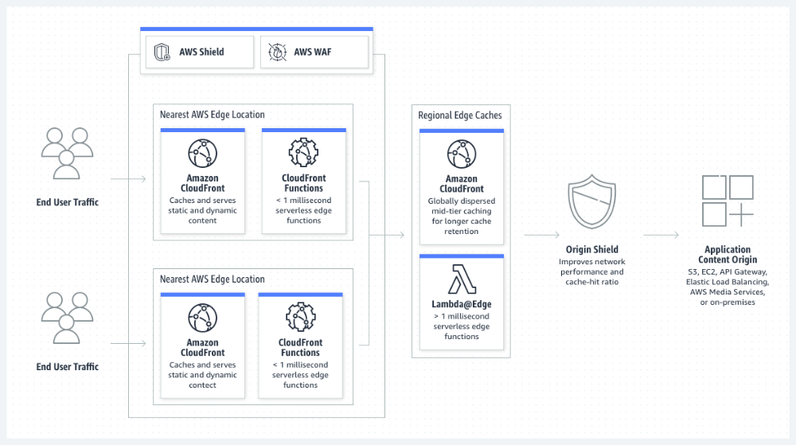

## 什么是 CDN？

内容分发网络（CDN）是一个互连服务器网络，可加快数据密集型应用程序的网页加载速度。CDN 可以表示内容分发网络或内容分配网络。当用户访问某个网站时，来自该网站服务器的数据必须通过互联网传输到用户的计算机。如果用户距离该服务器较远，则加载大文件（例如视频或网站图像）将需要很长时间。相反，如果网站内容存储在距离用户较近的 CDN 服务器上，就可以更快到达他们的计算机。

## 为什么 CDN 很重要？

内容分发网络（CDN）的主要目的是减少延迟，或减少由网络设计造成的通信延迟。由于互联网的全球性和复杂性，网站（服务器）与其用户（客户端）之间的通信流量必须跨越很长的物理距离。通信也是双向的，从客户端向服务器发送请求，服务器返回响应。

CDN 通过在客户端和网站服务器之间引入中间服务器来提高效率。这些 CDN 服务器将管理客户端与服务器之间的一些通信。它们可以降低传送到 Web 服务器的 Web 流量、减少带宽消耗，并改善应用程序的用户体验。

## CDN 有哪些优势？

内容分发网络（CDN）具有众多优势，可以提高网站性能并支持核心网络基础设施。例如，CDN 可以执行以下任务：

### 加快页面加载速度

如果您的页面加载速度太慢，网站流量可能会减少。CDN 可以降低跳出率并增加用户在您网站上停留的时间。

### 降低带宽成本

带宽成本是一笔巨大的开支，因为每个传入的网站请求都会消耗网络带宽。通过缓存和其他优化，CDN 可以减少原始服务器必须提供的数据量，从而降低网站所有者的托管成本。

### 提高内容可用性

同一时间的访客过多或网络硬件故障可能会导致网站崩溃。CDN 服务可以处理更多 Web 流量并降低 Web 服务器的负载。此外，如果一台或多台 CDN 服务器离线，其他运营服务器可以替换它们，以确保服务不中断。

### 提高网站安全性

分布式拒绝服务（DDoS）攻击试图通过向网站发送大量虚假流量来关闭应用程序。CDN 可以通过在多个中间服务器之间分配负载来处理此类流量峰值，从而降低对原始服务器的影响。

## CDN 技术的发展史

内容分发网络（CDN）技术兴起于 1990 年代后期，侧重于加快通过互联网分发内容的速度：

### 第一代

第一代 CDN 服务专注于智能网络流量管理和用于复制的数据中心的联网原理。

### 第二代

第二代 CDN 的出现是为了应对音频和视频流媒体服务（尤其是视频点播和新闻点播）的兴起。该项技术还不断发展，以解决在移动设备上进行内容交付的新挑战。各公司使用云计算技术和对等联网来加速内容交付。

### 第三代

第三代 CDN 仍在不断发展。作为全球领先的 CDN 服务提供商之一，AWS 正在推动创新。由于大多数 Web 服务集中在云中，因此现在的重点是边缘计算，即使用智能通信的智能设备管理带宽消耗。自治和自我管理的边缘网络可能是 CDN 技术的发展方向。

## CDN 可以分发哪些互联网内容？

内容分发网络（CDN）可以分发两种类型的内容：静态内容和动态内容。

### 静态内容

静态内容是不会因用户而异的网站数据。网站标题图像、徽标和字体样式对于所有用户都保持不变，并且企业不会经常更改它们。静态数据无需修改、处理或生成，非常适合存储在 CDN 上。

### 动态内容

诸如社交媒体新闻推送、天气报告、登录状态和聊天消息等动态内容因网站用户而异。这些数据会根据用户的位置、登录时间或用户首选项而变化，并且网站必须为每个用户和每次用户交互生成数据。

## CDN 的工作原理

内容分发网络（CDN）通过在多个地理位置建立一个入网点（PoP）或一组 CDN 边缘服务器来工作。这个分布在不同地理位置的网络基于缓存、动态加速和边缘逻辑计算的原则工作。

### 缓存

缓存是存储相同数据的多个副本以加快数据访问的过程。在计算中，缓存的原理适用于所有类型的内存和存储管理。在 CDN 技术中，该术语是指将静态网站内容存储在网络中多个服务器上的过程。 [CDN 中的缓存](https://aws.amazon.com/caching/cdn/)的工作原理如下：

1. 来自偏远地理位置的网站访客首次从您的网站请求静态 Web 内容。
2. 请求到达您的 Web 应用程序服务器或原始服务器。原始服务器将响应发送给远程访客。同时，它还将响应的副本发送到与该访客地理上最近的 CDN POP。
3. CDN POP 服务器将副本存储为缓存文件。
4. 下次该访客或该位置的任何其他访客发出相同的请求时，将由缓存服务器而不是原始服务器发送响应。 

### 动态加速

动态加速是指通过在 Web 应用程序和客户端之间设置中间 CDN 服务器，从而加快对动态 Web 内容请求的服务器响应。缓存不适用于动态 Web 内容，因为内容因用户请求而异。CDN 服务器必须针对每个动态请求重新连接原始服务器，但它们通过优化自己与原始服务器之间的连接加速了该过程。

如果客户端通过互联网直接向 Web 服务器发送动态请求，则该请求可能会由于网络延迟而丢失或延迟。此外，可能还需要花费时间打开和关闭连接以进行安全验证。另一方面，如果附近的 CDN 服务器将请求转发到原始服务器，它们就已经建立了一个持续的、受信任的连接。例如，以下功能可以进一步优化它们之间的连接：

-  智能路由算法
- 地理位置靠近原始服务器
- 能够处理客户端请求，缩减其大小

### 边缘逻辑计算

您可以对 CDN 边缘服务器进行编程，以执行简化客户端和服务器之间通信的逻辑计算。例如，此服务器可以执行以下操作：

- 检查用户请求并修改缓存行为。
- 验证和处理不正确的用户请求。
- 在响应之前修改或优化内容。

Web 服务器和网络边缘之间的应用程序逻辑分布有助于开发人员减轻原始服务器的计算需求并提高网站性能。

## CDN 的用途是什么？

内容分发网络（CDN）改善了正常的网站功能并提高了客户满意度。以下是一些示例使用场景。

### 高速内容分发

通过结合静态和动态互联网内容分发，您可以使用 CDN 为您的客户提供全球、高性能、全站点体验。例如，[路透社](https://aws.amazon.com/blogs/storage/a-look-inside-how-global-multimedia-agency-reuters-uses-amazon-web-services/)是全球最大的新闻发布商，向 BBC、CNN、纽约时报和华盛顿邮报等顶级频道发布新闻。路透社面临的新闻媒体挑战是及时向全球客户提供新闻内容。路透社使用 Amazon 的 CDN 服务 Amazon CloudFront 和 [Amazon Simple Storage Service（Amazon S3）](https://aws.amazon.com/s3/)来最大程度地减少对卫星链路通信的依赖，并创建一个更实惠、高度可用且安全的全球分布式网络平台。

### 实时响应

CDN 有助于以可靠且经济高效的方式分发丰富、高质量的媒体文件。流媒体视频和音频的公司使用 CDN 来克服三个挑战：降低带宽成本、增加规模和加快分发速度。例如，[Hulu](https://www.youtube.com/watch?v=EJQkBd_-CMo) 是 Walt Disney 公司旗下的在线视频流媒体平台。它使用 Amazon CloudFront 向不断增长的客户群持续传输超过 20 GBps 的数据。

### 多用户扩展

CDN 有助于支持大量并发用户。网站资源能够同时管理的客户端连接数量有限。CDN 可以通过减轻应用程序服务器的负载来快速扩展这一数量。例如，[King](https://aws.amazon.com/blogs/aws/king-using-amazon-cloudfront-to-deliver-mobile-games-to-over-200-countries/) 是一家游戏公司，它开发可随时随地从任何设备进行的社交连接、跨平台的游戏。King 的常规玩家人数超过 3.5 亿，他们每天在平台上的游戏场次超过 106 亿场。

King 的游戏应用程序将用户的游戏数据记录在中央数据中心，使他们可以在不同的设备上玩游戏而不会丢失进度。数据中心旨在为用户提供一致的体验，即使用户在带宽有限的旧机器上加入游戏也是如此。

King 使用 Amazon CloudFront 每天交付数百 TB 的内容，当它推出新游戏或启动大规模营销计划时，峰值会达到 0.5 PB 或更多。

## 什么是 Amazon CloudFront？

[Amazon CloudFront](https://aws.amazon.com/cloudfront/) 是一种内容分发网络（CDN）服务，旨在获得优异性能、安全性和开发人员便利性。您可以使用 Amazon CloudFront 执行以下任务：

- 借助自动网络映射和智能路由，通过 275 多个分散在全球各地的入网点（PoP）交付数据。

- 通过流量加密和访问控制提高安全性，并使用 AWS Shield Standard 防御分布式拒绝服务（DDoS）攻击，无需额外费用。

- 使用无服务器计算功能自定义您在 AWS 网络边缘运行的代码，以平衡成本、性能和安全性。

- 自动扩展，以高传输速率大规模分发软件、游戏补丁和 IoT 更新内容。

  

